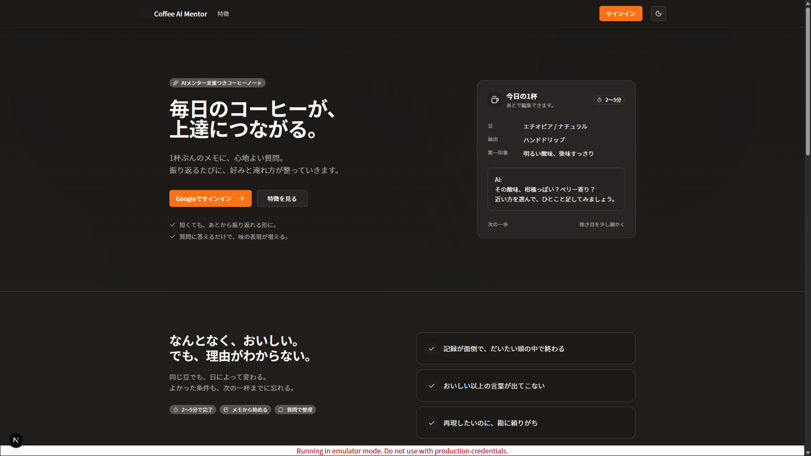
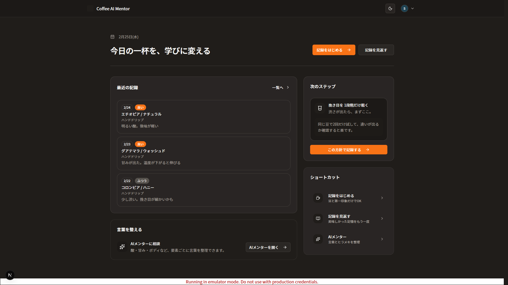
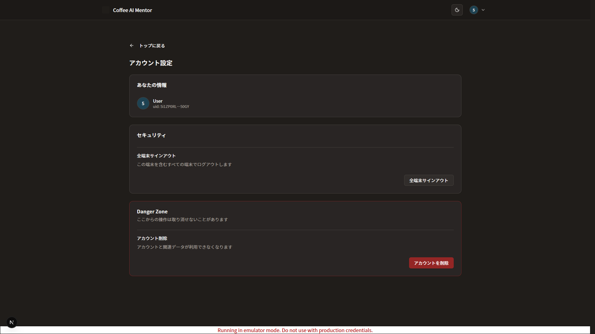

# Coffee AI Mentor

- [このプロジェクトについて](#このプロジェクトについて)
- [このリポジトリの目的](#このリポジトリの目的)
- [ローカル再現](#ローカル再現)
- [設計方針](#設計方針)
- [現在の実装範囲](#現在の実装範囲)
- [今後の実装予定](#今後の実装予定)
- [ドキュメント一覧](#ドキュメント一覧)
- [変更履歴](#変更履歴)

## このプロジェクトについて

  
  
  

AIメンター付きコーヒーノートアプリのポートフォリオです。

自宅コーヒー愛好家が「なんとなく美味しい」を卒業し、  
味の言語化と再現性を身につけるための学習体験を目指しています。  
（詳細は[プロダクトビジョン・問題定義](./docs/product/_overview/product-vision-and-problem-definition.md)を参照）

- [デモページ](https://coffee-ai-mentor-web-jvncegdyqq-an.a.run.app/)
- [デモ動画](https://drive.google.com/file/d/1Gpg-AIr98bRuLFxs7UwbgXTrBDh_sm7Y/view?usp=sharing)

※DB・LLMなどのアプリ本体は未実装です（段階的に追加予定）

## このリポジトリの目的

このリポジトリは、プロダクト実装と設計判断の記録を兼ねたポートフォリオです。

- フルスタック開発
- セキュリティ設計
- オブザーバビリティ設計
- 自動テスト
- CI/CD
- IaC（Infrastructure as Code）
- DaC（Docs as Code / Diagram as Code）

を、ドキュメントと実装をセットで統合的に示すことを目的にしています。

※開発にはCodexや複数のMCPサーバを活用しています。  
  最終的な仕様判断・レビュー・手直し・マージは人力で行っています。

## ローカル再現

ローカル再現手順は [`apps/web/README.md`](./apps/web/README.md) にまとめています。

- 本リポジトリは `Firebase Authentication Emulator` 前提のローカル検証手順を採用しています
- 認証フローを含むローカル再現には、Firebase プロジェクト作成と Web SDK 用の設定値の用意が必要です

## 設計方針

- アーキテクチャ概要  
  （詳細は[アーキテクチャ概要](./docs/architecture/architecture-overview.md)・[ディレクトリ構成](./docs/architecture/project-structure.md)を参照）
  - フロントエンド: Next.js（App Router）/ Feature-Sliced Design構成
  - バックエンド: Next.js（Route Handlers）/ クリーンアーキテクチャ構成
  - 認証: Firebase Authentication（session cookie 方式）
  - インフラ: Cloud Run + Terraform
  - CI/CD: GitHub Actions
  - オブザーバビリティ: Sentry + Cloud Logging
  - テスト: Vitest + Playwright + Firebase Authentication Emulator
  - 契約設計: HTTP 契約 / 型契約を明示

- セキュリティ設計
  - Cookie 安全属性設定（`HttpOnly` / `Secure` / `SameSite=Lax`）
  - CSRF 対策（Fetch Metadata + Origin/Referer 検証）
  - 認証 API の入力検証（JSON制限、サイズ制限、Zod バリデーション）
  - 無効 / 異常 cookie の早期排除
  - 秘密情報管理の責務分離方針（CI/CD と Cloud Run 側の管理方針を分離）

- オブザーバビリティ設計  
  （詳細は[横断的関心事](./docs/architecture/cross-cutting-concerns.md)を参照）
  - Cloud Logging の構造化ログ（リクエスト単位）
  - Sentry によるエラー監視
  - Sentry Uptime による死活監視（`/api/health/live`）

- テスト戦略  
  （詳細は [CI/CD・テスト戦略](./docs/process/ci-cd-and-test-strategy.md) を参照）
  - Vitest によるユニットテスト / 統合テスト
  - Playwright による E2E テスト（認証フロー中心）
  - Firebase Authentication Emulator を使った認証系テスト

## 現在の実装範囲

- 認証（Firebase Authentication + session cookie）
  - Cookie 安全属性設定（HttpOnly / Secure / SameSite=Lax）
  - CSRF 対策（Fetch Metadata + Origin/Referer 検証）
  - 認証 API の入力検証（JSON制限、サイズ制限、Zodバリデーション）
  - 無効/異常 cookie の早期排除

- セッション・アカウント管理機能
  - サインイン
  - サインアウト（操作端末）
  - 全端末サインアウト（refresh token revoke）
  - セッション確認 / ユーザー情報取得
  - アカウント削除（recent login 条件で再認証）

- フロントエンド UX 基盤
  - レスポンシブ対応
  - 認証状態のタブ間同期（BroadcastChannel）

- オブザーバビリティ
  - Sentry によるエラー監視
  - Sentry Uptime による死活監視（`/api/health/live`）
  - Cloud Logging の `request.summary` 構造化ログ

- テスト基盤
  - Vitest によるユニットテスト / 統合テスト
  - Playwright による E2E テスト（認証フロー）
  - Firebase Authentication Emulator を使った認証系テストの再現

- 開発・配信基盤
  - Docker イメージ化（コンテナ実行 / デプロイ用）
  - GitHub Actions によるデプロイ基盤
  - Terraform によるインフラ管理（Cloud Run / Firebase Auth / Sentry など）

## 今後の実装予定

- コーヒー記録機能（DB）
- AIメンター対話機能（LLM）
- アプリ側の本格レート制限（Redis）
- 既知攻撃パターン対策（WAF）
- Readiness ヘルスチェック（`/api/health/ready`）

## ドキュメント一覧

- プロダクト
  - [プロダクトビジョン・問題定義](./docs/product/_overview/product-vision-and-problem-definition.md)
  - [ユーザーストーリーマップ（バックボーン）](./docs/product/_overview/user-story-map-backbone.md)
  - [dogfooding フェーズ PRD（プロダクト要求仕様）](./docs/product/initiatives/00-dogfooding/product-requirements.md)

- アーキテクチャ / 設計
  - [アーキテクチャ概要](./docs/architecture/architecture-overview.md)
  - [ディレクトリ構成](./docs/architecture/project-structure.md)
  - [画面遷移・状態管理](./docs/architecture/ui-rendering-and-state.md)
  - [ドメイン・データモデル](./docs/architecture/domain-and-data-model.md)
  - [横断的関心事（セキュリティ / 監視 など）](./docs/architecture/cross-cutting-concerns.md)

- 開発プロセス
  - [CI/CD・テスト戦略](./docs/process/ci-cd-and-test-strategy.md)
  - [開発参加ガイド](.CONTRIBUTING.md)

- API契約
  - [認証セッション](./contracts/src/auth/auth-session.http.md)
    - `POST /api/auth/session` : ID token を session cookie に交換
    - `GET /api/auth/session` : セッション状態確認
    - `DELETE /api/auth/session` : この端末のサインアウト
  - [認証セッション失効（全端末サインアウト）](./contracts/src/auth/auth-session-revoke.http.md)
    - `POST /api/auth/session/revoke` : 全端末サインアウト
  - [ユーザー情報（自分）](./contracts/src/users/users-me.http.md)
    - `GET /api/users/me` : 自分情報取得
    - `DELETE /api/users/me` : アカウント削除

- ADR（設計判断記録）
  - [ADR 0001: 認証セッションに Route Handlers を採用](./docs/adrs/0001-use-route-handlers-for-auth-session.md)
  - [ADR 0002: 境界ベース Result パターンを採用](./docs/adrs/0002-adopt-boundary-based-result-pattern-for-nextjs.md)
  - [ADR 0003: Firebase session cookie 交換方式を採用](./docs/adrs/0003-adopt-firebase-session-cookie-exchange-for-web-session-management.md)
  - [ADR 0004: CI/CD と Cloud Run の秘密情報管理方針を採用](./docs/adrs/0004-adopt-hybrid-secret-management-for-ci-cd-and-cloud-run.md)
  - [ADR 0005: リクエスト単位のログの Cloud Logging 制御方針を採用](./docs/adrs/0005-adopt-cloud-logging-controls-for-request-summary-volume.md)

- 機能詳細 / 実装メモ
  - [認証エラーコードマッピング（Firebase Auth）](./docs/feature/firebase-auth-error-code-mapping.md)

## 変更履歴

[CHANGELOG.md](./CHANGELOG.md) を参照
