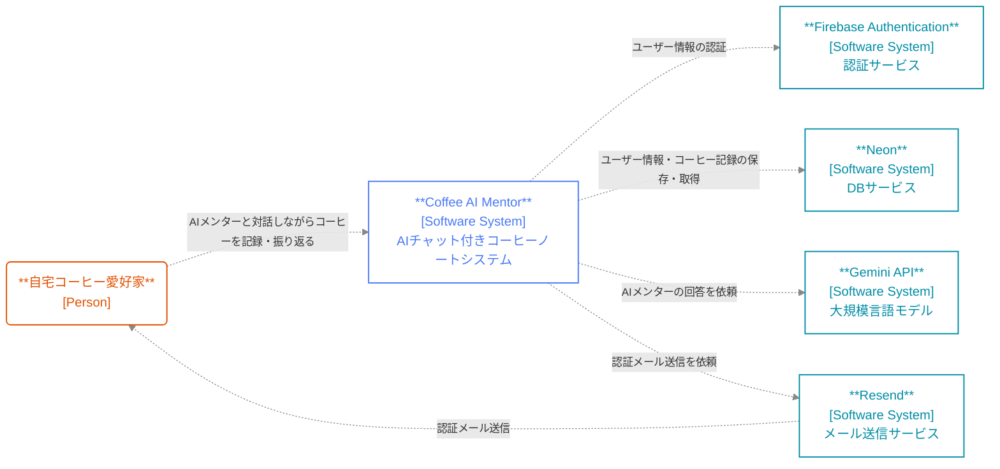
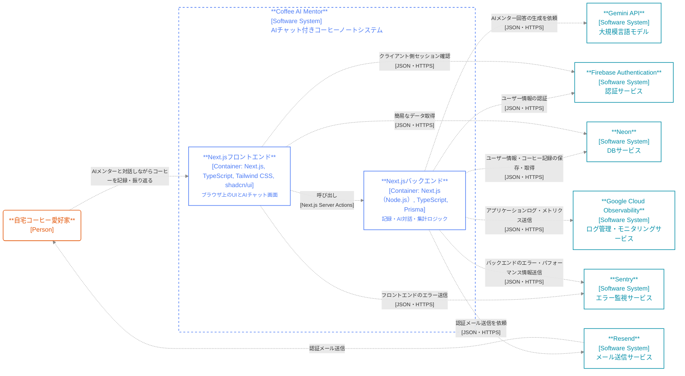

# Coffee AI Mentor - Architecture Overview

- [1. システムコンテキスト図](#1-システムコンテキスト図)
- [2. コンテナ図](#2-コンテナ図)
- [3. 技術スタック](#3-技術スタック)
- [4. 外部依存](#4-外部依存)
- [5. デプロイ環境](#5-デプロイ環境)

## 1. システムコンテキスト図

- [C4 model「System context diagram」](https://c4model.com/diagrams/system-context)を参考

## 2. コンテナ図

- [C4 model「Container diagram」](https://c4model.com/diagrams/container)を参考
- フロントエンドとバックエンドは同一デプロイユニットで動いているが、責務的に論理分割

## 3. 技術スタック

- 開発環境
  - Docker
- インフラ構成管理
  - Terraform
- パッケージマネージャ
  - pnpm
- 開発言語・フレームワーク
  - Next.js
  - TypeScript
- UI・スタイリング
  - Tailwind CSS
  - Shadcn/ui
- ツアーガイド
  - React Joyride
- リンター・フォーマッター
  - Biome
  - Prettier（マークダウン用）
- フォーム・バリデーション
  - React Hook Form
  - Zod
- 状態管理
  - TanStack Query
  - Zustand
- テスト
  - Vitest
  - Testing Library
  - Playwright
- テスト支援
  - Mock Service Worker
  - Fetch Cookie
  - Tough Cookie
  - Firebase Authentication emulator
  - Execa
- 環境変数
  - dotenv
- ORM
  - Prisma
- 認証
  - Firebase Authentication JavaScript SDK
  - Firebase Admin SDK
- 日付操作
  - date-fns

## 4. 外部依存

- ホスティング
  - Google Cloud Run
- LLM
  - Vercel AI SDK
  - Gemini API
- DB
  - Neon（Postgres + Row Level Security）
- 認証
  - Firebase Authentication
- リポジトリ
  - GitHub
- CI/CD
  - GitHub Actions
- ログ・モニタリング
  - Sentry
  - Google Cloud Logging
  - Google Cloud Monitoring
- メール
  - Resend

## 5. デプロイ環境

- ステージング環境は、将来ユーザー数が増えた段階で追加

<!-- prettier-ignore -->
| 環境             | 開発環境                | ステージング環境 | 本番環境                                                              |
| --------------- | ---------------------- | ------------- | -------------------------------------------------------------------- |
| ホスティング      | 開発PC上のDockerコンテナ  |       -       | Google Cloud Runプロジェクト`coffee-ai-mentor-prod`（asia-northeast1） |
| DB              | Supabase CLI           |       -       | Supabaseプロジェクト`coffee-ai-mentor-prod`                            |
| 認証             | Supabase CLI           |       -       | 上記Supabase Auth                                                    |
| LLM             | 開発用Gemini APIキー     |       -       | `GEMINI_API_KEY_PROD`を用いたGemini API呼び出し                        |
| ログ・モニタリング | ローカルログ出力          |       -       | Sentryプロジェクト`coffee-ai-mentor-prod`・Cloud Logging               |
| メール           | モック or ローカルログ出力 |       -       | Resendプロジェクト`coffee-ai-mentor`（prodキー）                        |
