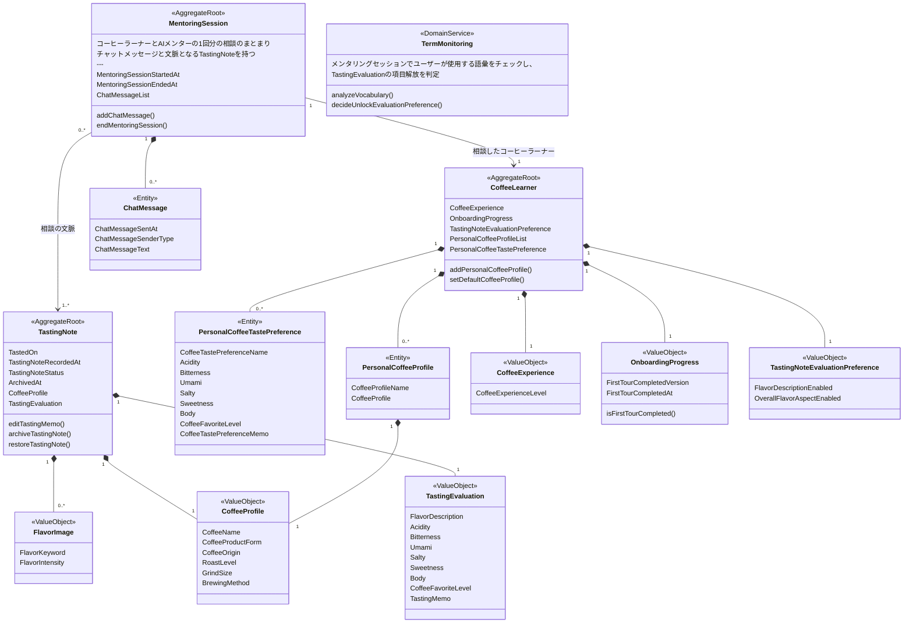
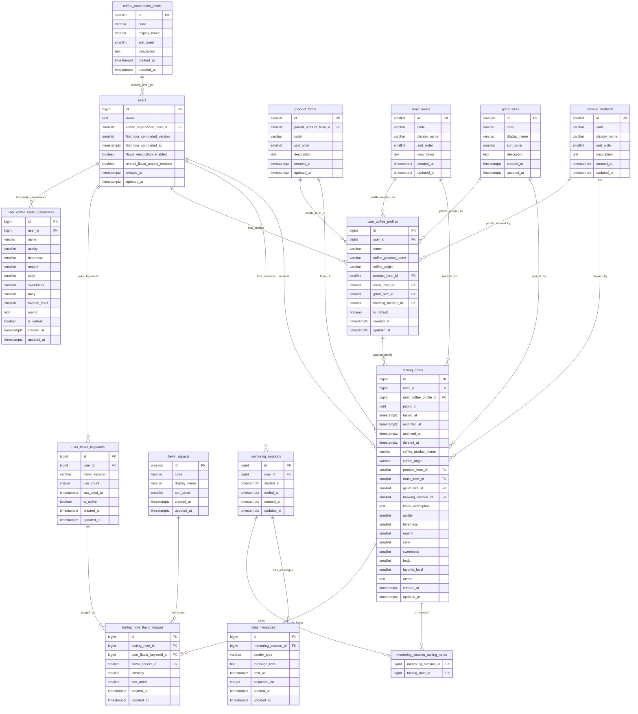

# Coffee AI Mentor - Domain and Data Model

- [1. 用語・参照マスタ草案](#1-用語参照マスタ草案)
  - [1.1 ユーザー関連](#11-ユーザー関連)
  - [1.2 テイスティングノート関連](#12-テイスティングノート関連)
  - [1.3 メンタリングセッション関連](#13-メンタリングセッション関連)
  - [1.4 用語モニタリング関連](#14-用語モニタリング関連)
- [2. データモデル](#2-データモデル)
  - [2.1 ドメインモデル](#21-ドメインモデル)
  - [2.2 ER図](#22-er図)

## 1. 用語・参照マスタ草案

### 1.1 ユーザー関連

- CoffeeLearner（コーヒーラーナー）：コーヒー評価者としてのユーザー
  - SelfEvaluation（自己評価）：言語化力・再現性・満足度
    - CoffeeExperienceLevel（コーヒー経験レベル）：自己申告のコーヒーの詳しさレベル
      - Beginner（初心者）
        - 味覚の弁別：「苦い」「薄い」くらいのざっくりした違いは感じる。
        - 言語化力：「普通」「美味しい」「微妙」レベルで、具体的な形容詞はあまり出てこない。
        - 抽出コントロール：レシピはほぼ勘・固定。
      - CasualDrinker（カジュアルドリンカー）
        - 味覚の弁別：好きなブランドや商品・よく行く店がある。
        - 言語化力：味の説明は得意じゃないが、「スッキリ」「コクがある」など、少数の定番ワードで味を表現する。
        - 抽出コントロール：レシピはほぼ勘・固定。
      - CasualExplorer（カジュアルエクスプローラー）
        - 味覚の弁別：酸味・苦味など味覚の違いを意識し始めている。
        - 言語化力：「フルーティー」「ナッツっぽい」など、ざっくりした語彙で表現できる。
        - 抽出コントロール：レシピはほぼ勘だが、味の違いには気づける。
      - Explorer（エクスプローラー）
        - 味覚の弁別：焙煎度や産地によって味がどう変わるのか結びつき始めている。
        - 言語化力：「明るい酸味」「チョコっぽい甘み」など、2語以上の組み合わせで説明できる
        - 抽出コントロール：意図的に挽き目・抽出時間・粉量・湯量などを変えて試し始めている。
      - Enthusiast（愛好家）
        - 味覚の弁別：酸味・甘味・苦味・ボディ・後味などの強弱を、自分なりのスケールで安定して評価できる。焙煎度や産地の違いも、方向性としてかなりはっきり感じ取れる。
        - 言語化力：「熟したベリーのようなジューシーな酸味と、黒糖のような丸い甘みが長く続く」くらいのフレーズを比較的一貫して出せる。
        - 抽出コントロール：挽き目・抽出時間・粉量・湯量などを調整し、目標の味にある程度寄せられる。
  - TastingNoteEvaluationPreference（テイスティングノート評価軸選択）：テイスティングノートの評価項目のON・OFF。TermMonitoring（用語モニタリング）により、この設定項目自体が解放されていく仕組み。
    - FlavorDescriptionEnabled（フレーバー記述有効化）
    - OverallFlavorAspectEnabled（全体的フレーバー観点有効化）
  - PersonalCoffeeProfileList（ユーザーのコーヒープロファイルリスト）：いつも飲むコーヒープロファイル。プリセット保存。
  - CoffeeTastePreference（ユーザーのコーヒーの好み）：好みの味を言語化

- UserConfig（ユーザー設定）：ユーザーごとの各種設定

- CupExperience（1杯のコーヒー体験）：コーヒー1杯の体験ユニット。MentoringSession（メンタリングセッション）とTastingNote（テイスティングノート）を合わせたもの。

### 1.2 テイスティングノート関連

- TastingNote（テイスティングノート）：コーヒーの風味評価に関する学習ノート
  - CoffeeProfile（コーヒープロファイル）
    - CoffeeName（コーヒーの商品名）
    - CoffeeProductForm（コーヒーの製品形態）：コーヒーの提供元の分類
      - HomeBrewed（自家製）
        - Instant（インスタント）
        - DripBag（ドリップバッグ）
        - CoffeeBean（コーヒー豆）
          - GreenCoffeeBean（生豆）
          - RoastedCoffeeBean（焙煎豆）
          - GroundCoffeeBean（コーヒー粉）
      - CafeBrewed（カフェ製）
      - ReadyToDrink（既製品）
    - CoffeeOrigin（産地）
    - RoastLevel（焙煎度）
      - LightRoast（ライトロースト／浅煎り）：明るい黄〜小麦色。香りやコクはまだ控えめで、軽くシャープな酸味が中心の味わい。参考L値の目安はおおよそ 27 以上（値が大きいほど浅煎り）。
      - CinnamonRoast（シナモンロースト／浅煎り）：シナモンのような淡い茶色。まだ浅めの焙煎で、フレッシュさや青さを感じる香りと、はっきりした酸味が出やすい。参考L値の目安は 25〜27 前後。
      - MediumRoast（ミディアムロースト／中煎り）：茶褐色。軽めのコクと酸味で、すっきり飲みやすいバランス。参考L値の目安は 22.5〜25 前後。
      - HighRoast（ハイロースト／中煎り）：ダークブラウン寄りのブラウン。家庭や喫茶店でよく出てくる、標準的なレギュラーコーヒーに近い印象。酸味・苦味・コクのバランスがとれ始めるゾーン。参考L値の目安は 20.5〜22.5 前後。
      - CityRoast（シティロースト／中煎り〜中深煎り）：艶のある濃いコーヒーブラウン。酸味と苦味がちょうど中間くらいで、多くのドリップコーヒーやエスプレッソにも使われる「いちばん汎用的な焙煎度」。参考L値の目安は 18.5〜20.5 前後。
      - FullCityRoast（フルシティロースト／深煎り寄り）：ダークブラウン。苦味とコクがはっきりしてきて、アイスコーヒーやしっかりした味わいのエスプレッソに向く。参考L値の目安は 16.5〜18.5 前後。
      - FrenchRoast（フレンチロースト／深煎り）：かなり黒に近いダークブラウン。強い苦味と力強い香りが出るため、カフェ・オ・レやウィンナーコーヒーなど、ミルクと合わせるヨーロッパ風アレンジドリンクに使われることが多い。参考L値の目安は 15〜16.5 前後。
      - ItalianRoast（イタリアンロースト／最深煎り）：ほぼ黒色。オイル感が出やすく、非常に強い苦味と濃厚なコクが特徴で、エスプレッソやカプチーノなど、超どっしり系の一杯に使われる。参考L値の目安は 15 未満。
    - GrindSize（挽き目）
      - ExtraCoarse（極粗挽き）：大きめの岩塩級（約1200µm以上）。コールドブリュー（水出し）や、長時間じっくり浸けて抽出するレシピ向け。渋みを抑えて、かなりマイルドな味になりやすい。
      - Coarse（粗挽き）：岩塩〜ザラメ砂糖級（約1000µm〜1200µm）。フレンチプレスやパーコレーターなど、金属フィルターで粉がそのまま浸かる抽出に向く。すっきり軽めの飲み口になりやすい。
      - MediumCoarse（中粗挽き）：ザラメ砂糖級（約800µm〜1000µm）。ペーパードリップ、ネルドリップ、エアロプレスなどでゆっくり落とす抽出に向く。クリアだけど少し軽めにしたいときに使われやすい。
      - Medium（中挽き）：グラニュー糖級（約600µm〜800µm）。ペーパードリップ、ネルドリップなどに適した標準的な挽き目。迷ったらまずここから。
      - MediumFine（中細挽き）：グラニュー糖と粉砂糖級（約400µm〜600µm）。円錐型ドリッパーでキレを出したいときや、短時間で落とす浸漬式の抽出器具、直火式エスプレッソポットより少し粗めにしたいときなどに使われる。
      - Fine（細挽き）：粉砂糖〜薄力粉級（約200µm〜400µm。エスプレッソマシンやモカポット向け。短時間・高圧で一気に抽出するスタイルに使う挽き目で、濃厚な味になりやすい。
      - ExtraFine（極細挽き）：ベビーパウダー級（約200µm以下）。トルココーヒー（イブリック）など、粉ごと一緒に飲む特殊なスタイル専用。ふつうのフィルター抽出ではまず使わないレベルの細かさ。
    - BrewingMethod（淹れ方）：コーヒーの淹れ方
      - PaperDrip（ペーパードリップ）
      - NelDrip（ネルドリップ）
      - ImmersionDripper（浸漬式ドリッパー）
      - FrenchPress（フレンチプレス）
      - ColdBrew（コールドブリュー／水出し）
      - Syphon（サイフォン）
      - EspressoMachine（エスプレッソマシン）
      - MokaPot（モカポット）
      - AeroPress（エアロプレス）
      - AutoDripMachine（コーヒーメーカー）
  - TastingEvaluation（コーヒー評価）
    - FlavorDescription（フレーバー記述）：自由記述でざっくばらんに
    - FlavorImage（フレーバーイメージ）：フレーバーホイール的な用語を任意に選び、円グラフで視覚的に割合表現
      - Overall（全体的）：
      - Aftertaste（後味）：
    - Acidity（酸味）
    - Bitterness（苦味）
    - Umami（旨味）
    - Salty（塩味）
    - Sweetness（甘み）
    - Body（ボディ）：油分や微粒子などによる感じる粘性やとろみ
    - CoffeeFavoriteLevel（好み度）：また飲みたいと思う度合い
    - Memo（テイスティングメモ）：AIチャットと話した学びなど自由にメモ
  - TastedOn（飲んだ日）
  - TastingNoteRecordedAt（記録日時）

- ProductInvolvementLevel（製品関与度）：ユーザーが行った工程がどこまでかをコントロールするための値。CoffeeProductForm（コーヒーの製品形態）で変化

### 1.3 メンタリングセッション関連

- MentoringSession（メンタリングセッション）：n杯の体験をとおしたAIとの対話。
  - ChatMessage（チャットメッセージ）：ユーザー・AIそれぞれの1発言。
    - ChatMessageSenderType（発言者）：ユーザー／AIどちらの発言か
    - ChatMessageSentAt（送信日時）
    - ChatMessageMessageText（発言内容）
  - MentoringSessionStartedAt（開始日時）
  - MentoringSessionEndedAt（終了日時）：まとめて終わる指示をボタンなどでAIに出してから、AIがまとめを出し終えた日時。ここでメモ残すかどうかナッジする

- AiMentor（AIメンター）：コーヒーについて相談できるLLM
  - generateReply（回答生成）

### 1.4 用語モニタリング関連

- TermMonitoring（用語モニタリング）：メンタリングセッションでユーザーが使用する語彙をチェックし、TastingEvaluation（コーヒー評価）の項目解放を判定。解放後は設定でON・OFFできるように（はじめは自由記述評価欄のみ）
  - analyzeVocabulary（語彙解析）
  - decideUnlockEvaluationPreference（評価項目解放判定）

## 2. データモデル

### 2.1 ドメインモデル

<!--
・オブジェクトとメソッドの分類判断
  ・AggregateRoot：整合性の境界となるもの。一貫性の更新単位。外部から参照される主要概念。
    →「複数要素の調整」が必要な操作、集約内の不変条件を守る操作

  ・ValueObject：値が同じなら同じ扱いのもの。バリデーションや正規化のルールがある。
    →判定、正規化、比較派生値の計算、新しい値を返す

  ・Entity：IDを振って同一性を持たせたいもの。履歴をもったりや他から参照される。
    →その個体だけで完結する状態変更

  ・DomainService：複数オブジェクトにまたがる処理になるもの。外部依存を伴うことが多い。
    →複数モデルに跨る判断/計算、アルゴリズム・解析・外部依存が本体の処理
-->

### 2.2 ER図

