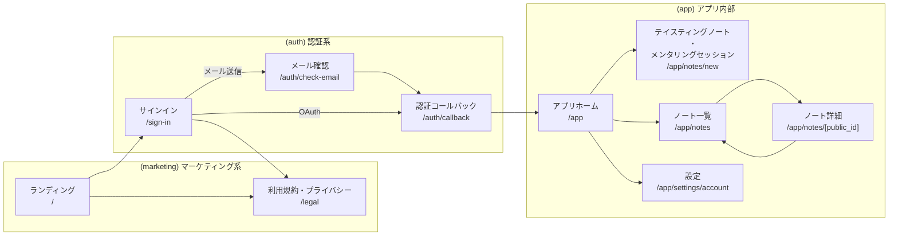

# Coffee AI Mentor - UI Rendering and State

- [1. 画面遷移](#1-画面遷移)
  - [1.1 画面遷移図](#11-画面遷移図)
  - [1.2 リダイレクトルール](#12-リダイレクトルール)
  - [1.3 ナビゲーション規約](#13-ナビゲーション規約)
- [2. 状態管理方針](#2-状態管理方針)
  - [2.1 真実の情報源](#21-真実の情報源)
  - [2.2 状態の設計ルール](#22-状態の設計ルール)

## 1. 画面遷移

### 1.1 画面遷移図

- 将来的には複数のテイスティングノートをもとにメンタリングセッションを行う専用画面を追加予定
- App内はナビゲーションから各ページへ移動可能

### 1.2 リダイレクトルール

- セッションを保持している場合、サインインに飛ぶとアプリホームへリダイレクト
- 初回ガイドツアーはアプリホーム画面・テイスティングノート・メンタリングセッション画面で行われる。  
  初回ガイドツアーが完了するまでは、他のページは隠しておく＆アプリホームへリダイレクト

  <!-- prettier-ignore -->
  | 現在地                               | セッション | 初回ガイドツアー | リダイレクト          |
  | ----------------------------------- | -------- | ------------- | -------------------- |
  | (auth) `/sign-in`                   |    あり   |       -       | `/app`へリダイレクト   |
  | (app) `/app/*`                      |    なし   |       -       | `/sign-in`へ         |
  | (app) `/app/*`(`/app/notes/new`以外) |    あり   |   未完了       | `/app`へ             |

### 1.3 ナビゲーション規約

- アプリ内部の通常遷移は原則next/linkの`<Link>`を使う
- 強制リダイレクトはNext.js App Routerの`redirect()`を使う
- イベント結果による自動遷移（作成成功、保存完了、サインアウト等）はNext.js App Routerの`useRouter()`を使う
  - 履歴を残したい遷移は`router.push`、残したくない遷移は`router.replace`
  - モーダルをParallel/Intercepting RoutesでURL化し、`router.back()`で閉じ、`router.forward()`で再表示

## 2. 状態管理方針

### 2.1 真実の情報源

- Supabase Database：永続データ
- TanStack Query：サーバーデータの取得（Query）と更新（Mutation）、それらのキャッシュと状態（loading/error含む）
- React Hook Form：入力途中のフォーム状態（保存前の一時）
- localStorage：入力ドラフトの永続スナップショット（復元用バックアップ）
- Zustand：表示・操作の制御状態（トースト、ダイアログ、モーダル開閉、ツアー表示ステップなど）
- URL：ルーティング状態（直リンクで復元・共有したい見え方）

### 2.2 状態の設計ルール

- 派生値はstateに保持しない（表示用の集計・フィルタ結果などは算出する）
- boolean乱立を避け、同時成立してはいけないものは`status`で表現する
- 遷移はsetterではなくEventで記述する
- 失敗時のUX（退避・再試行・価値維持）を先に決める
