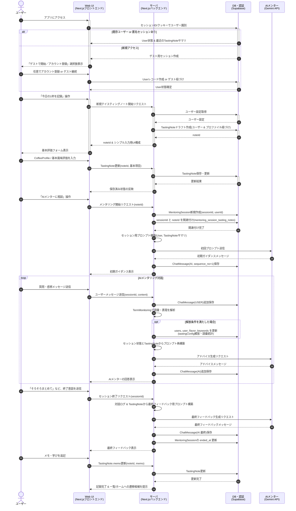

# Coffee AI Mentor - Runtime Sequences

- [代表シーケンス図](#代表シーケンス図)

## 代表シーケンス図

- ユーザーがコーヒーの評価を行う
- AIメンターと対話し、アドバイスをもらう
- アドバイスを元に再評価する
- AIメンターからフィードバックをもらう

```mermaid
sequenceDiagram
    %% 参加者（コンテナ級）
    actor ユーザー as ユーザー
    participant 画面 as Web UI<br/>(Next.jsフロントエンド)
    participant サーバ as サーバ<br/>(Next.jsバックエンド)
    participant データ as DB・認証<br/>(Supabase)
    participant AI as AIメンター<br/>(Gemini API)

    autonumber

    %% --- (1) アクセス & セッション／サインイン判定 ---
    ユーザー ->>+ 画面: アプリにアクセス
    画面 ->>+ データ: セッションID/クッキーでユーザー識別
    alt 既存ユーザー or 匿名セッションあり
        データ -->> 画面: User状態 & 最近のTastingNoteサマリ
    else 新規アクセス
        データ -->>- 画面: ゲスト用セッション作成
        画面 -->>- ユーザー: 「ゲストで開始／アカウント登録」選択肢表示
        ユーザー ->> 画面: 任意でアカウント登録 or ゲスト継続
        画面 ->>+ データ: Userレコード作成 or ゲスト紐づけ
        データ -->>- 画面: User状態確定
    end

    %% --- (2) 新しい1杯の記録開始 ---
    ユーザー ->>+ 画面: 「今日の1杯を記録」操作
    画面 ->>+ サーバ: 新規テイスティングノート開始リクエスト
    サーバ ->>+ データ: ユーザー設定取得
    データ -->>- サーバ: ユーザー設定
    サーバ ->>+ データ: TastingNoteドラフト作成(ユーザー & プロファイル紐づけ)
    データ -->>- サーバ: noteId
    サーバ -->>- 画面: noteId & シンプル入力用UI構成
    画面 -->>- ユーザー: 基本評価フォーム表示

    %% --- (3) 1杯分の基本評価入力 ---
    ユーザー ->> 画面: CoffeeProfile / 基本風味評価を入力
    画面 ->>+ サーバ: TastingNote更新(noteId, 基本項目)
    サーバ ->>+ データ: TastingNote保存・更新
    データ -->>- サーバ: 更新結果
    サーバ -->>- 画面: 保存済み状態の反映

    %% --- (4) AIメンタリングセッション開始 ---
    ユーザー ->> 画面: 「AIメンターに相談」操作
    画面 ->> サーバ: メンタリング開始リクエスト(noteId)
    サーバ ->> データ: MentoringSession新規作成(sessionId, userId)
    サーバ ->> データ: sessionId と noteId を関連付け(mentoring_session_tasting_notes)
    データ -->> サーバ: 関連付け完了
    サーバ ->> サーバ: セッション用プロンプト構築(User, TastingNoteサマリ)
    サーバ ->> AI: 初回プロンプト送信
    AI -->> サーバ: 初期ガイダンスメッセージ
    サーバ ->> データ: ChatMessage(AI, sequence_no=1)保存
    サーバ -->> 画面: 初期ガイダンス表示

    %% --- (5) メンタリング対話ループ ---
    loop AIメンタリング対話
        ユーザー ->> 画面: 質問・感想メッセージ送信
        画面 ->> サーバ: ユーザーメッセージ送信(sessionId, content)
        サーバ ->> データ: ChatMessage(USER)追加保存
        サーバ ->> サーバ: TermMonitoringで語彙・表現を解析
        opt 解放条件を満たした場合
            サーバ ->> データ: users, user_flavor_keywords を更新<br/>(tastingConfig解放・語彙統計)
        end
        サーバ ->> サーバ: セッション状態とTastingNoteからプロンプト再構築
        サーバ ->> AI: アドバイス生成リクエスト
        AI -->> サーバ: アドバイスメッセージ
        サーバ ->> データ: ChatMessage(AI)追加保存
        サーバ -->> 画面: AIメンターの回答表示
    end

    %% --- (6) 対話の締め & 最終フィードバック ---
    ユーザー ->> 画面: 「そろそろまとめて」など、終了意図を送信
    画面 ->> サーバ: セッション終了リクエスト(sessionId)
    サーバ ->> サーバ: 対話ログ & TastingNoteから最終フィードバック用プロンプト構築
    サーバ ->> AI: 最終フィードバック生成リクエスト
    AI -->> サーバ: 最終フィードバックメッセージ
    サーバ ->> データ: ChatMessage(AI 最終)保存
    サーバ ->> データ: MentoringSessionの ended_at 更新
    サーバ -->> 画面: 最終フィードバック表示

    %% --- (7) 任意メモの記録 & 完了 ---
    ユーザー ->> 画面: メモ・学びを追記
    画面 ->> サーバ: TastingNote.memo更新(noteId, memo)
    サーバ ->> データ: TastingNote更新
    データ -->> サーバ: 更新完了
    サーバ -->> 画面: 記録完了 & 一覧/ホームへの遷移候補を提示
```
